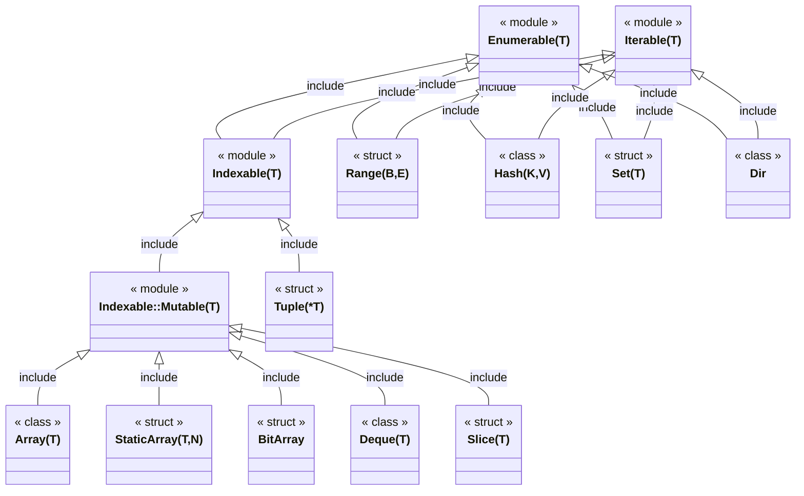

# Crystal Lang Learning

## Some Links

- https://www.slideshare.net/crystallanguage/crystal-internals-part-1-70673255
- https://www.slideshare.net/crystallanguage/crystal-presentation-at-recurse-center-ny
- https://lbarasti.com/post/json_beyond_basics
- https://lbarasti.com/post/select_statement

## Enumerable/Iterable

